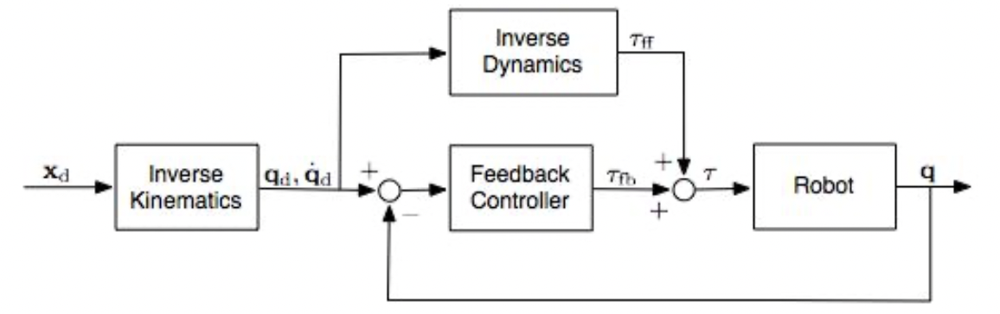
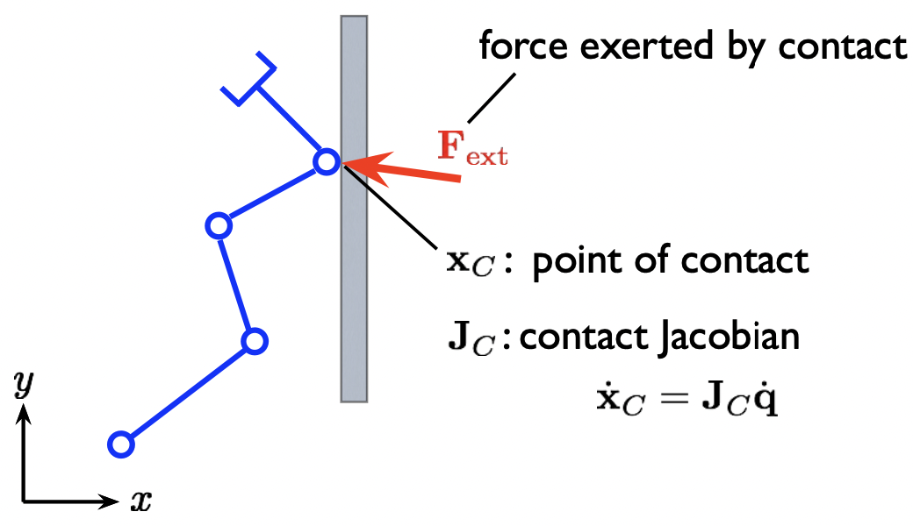
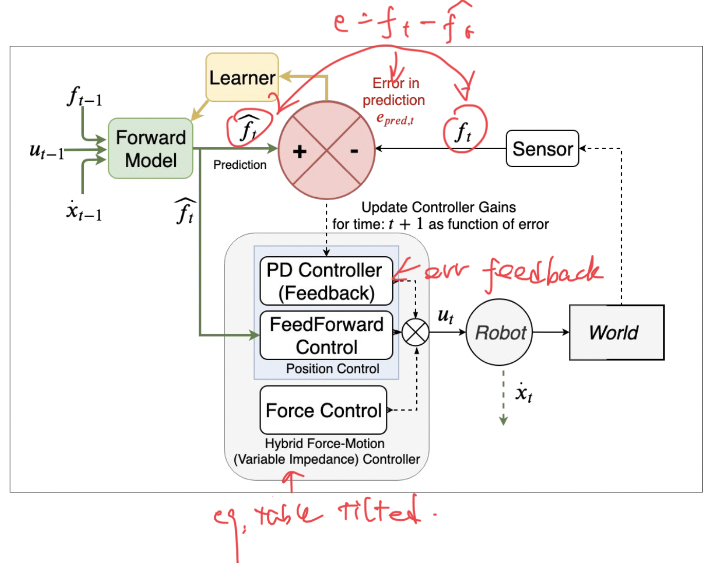

<link type="text/css" rel="stylesheet" href="../md.css">

# [Home](../../index.md) > [Advanced Robotics](README.md) > Controls
> generate $\tau$ to get $\ddot{q}$
### Feedforward control ( open loop )
Inverse Dynamics
$$
\tau = M(q_d)\ddot{q}_d + C(q_d,\dot{q}_d)+G(q_d)
$$
Forward/Direct Dynamics
$$
\ddot{q}  = M(q)^{-1}(-C(q, \dot{q})-G(q)+\tau)
$$
> eg. the pendulum system:
> $$
I\ddot\theta + k\dot\theta+rmg\theta = \tau
$$

## Feedback steady-state error

### Inverse dynamics control
Compare output $\ddot{q}$ with desired trajectory and correct.
Let
$$
\tau = \underbrace{k_p(\theta_d-\theta)}_{\text{spring}}\underbrace{-k_v\dot{\theta}}_\text{damper}
$$
to manipulate the dynamics of the system.

> $$
I\ddot\theta + k\dot\theta+rmg\theta = \tau = -k_p(\theta_d-\theta)-k_v\dot{\theta}
> $$
> $$
\red{I\ddot\theta + (k+k_v)\dot\theta}+(rmg+k_p)\theta = k_p\theta_d
$$

System will end at $t \rightarrow \infty, (\ddot\theta=0,\dot\theta=0)$:
$$
\theta=\frac{k_p}{\red{rmg} +k_p}\theta_d
$$

Because of gravity $rmg$ system will not reach target but will get close for large $k_p$. The steady state error is defined as:
$$
e_{ss} = \theta_d(\infty)-\theta(\infty) = \frac{rmg}{rmg+k_p}
$$
steady state error is finite if $g\neq0$.

**PID controller**: (I sums up remaining error. Generally _NOT_ safe for robots)
$$
\tau = \underbrace{k_p(\theta_d-\theta)}_{\text{P:Proportional }}\underbrace{-k_v\dot{\theta}}_\text{ D:Derivative}+\underbrace{\red{k_i\int(\theta_d-\theta)dt}}_\text{I:Integral}
$$

**More general**:
$$
\tau = K_P(q_d-q)-K_D(\dot q_d-\dot q)
$$
$$
e_{ss} = q_d-q=K_P^{-1}G(q)
$$
$K_P,K_D$ are diagnal matrices with each joint of value $k_{Pi},k_{Di}$.

### Gravity compensation
PD control with gravity compensation(Safer than PID):
$$
\tau = \underbrace{k_p(\theta_d-\theta)}_{\text{P:Proportional }}\underbrace{-k_v\dot{\theta}}_\text{ D:Derivative}+\underbrace{rmg\theta}_\text{gravity compensation}
$$

> $$
I\ddot\theta + k\dot\theta+rmg\theta = \tau = -k_p(\theta_d-\theta)-k_v\dot{\theta}+rmg\theta
> $$
> $$
\red{I\ddot\theta + (k+k_v)\dot\theta} + k_p\theta = k_p\theta_d
$$

System will end at $t \rightarrow \infty, (\ddot\theta=0,\dot\theta=0)$:
$$
k_p\theta=k_p\theta_d
$$
$$
e_{ss} = \theta_d-\theta = 0
$$
$rmg\theta$ is a feedforward estimation of gravity force. The controller is **model-based**(need to know G).

**More general**:
$$
\tau = K_P(q_d-q)-K_D(\dot q_d-\dot q) + \red{G(q)}
$$
$$
e_{ss} = q_d-q=0
$$

## tracking complete trajectory
### Feedback linearisation
Let
$$
\tau = M(q)\red{(\ddot q_d+K_P(q_d-q)+K_D(\dot q_d-\dot q))} + C(q,\dot{q})+G(q)
$$
Then dynamics equation reduces to:
$$
\underbrace{\ddot{q_d}-\ddot q}_{\ddot{e}}+K_P(\underbrace{q_d-q}_{e})+K_D(\underbrace{\dot q_d-\dot q}_{\dot{e}})=0
$$
define $e,\dot{e},\ddot{e}$ as above, we get:
$$
\ddot{e}+K_D\dot{e}+K_Pe=0
$$
_2nd order linear diff equation_, err guaranteed to go to zero provided $K_P,K_D$ set correctly. Can control decay and frequency of tracking error.

⬆️ **ALL Joint space control**

### Task space control
Desired motion in task space ( end effector ).

Task acceleration:
$$
\dot{x} = J(q)\dot{q}
$$
$$
\ddot{x} = J(q)\red{\ddot{q}}+\dot J(q)\dot{q}
$$
Plug into Direct Dynamics:
$$
\red{\ddot{q}}  = M(q)^{-1}(-C(q, \dot{q})-G(q)+\red{\tau})
$$
In static equilibrium, relationship between end-effector force $F$ and Joint torque $\tau$:
$$
\red{\tau} = J^TF
$$

we get:
$$
\ddot{x} = -JM^{-1}C-JM^{-1}G+JM^{-1}\underbrace{J^TF}_{\tau}+\dot{J}\dot{q}
$$

Multiply everything by $(JM^{-1}J^T)^{-1}$ get **Operational Space Dynamics**:
$$
\underbrace{(JM^{-1}J^T)^{-1}}_{M_x(q)}\ddot{x}
+\underbrace{(JM^{-1}J^T)^{-1}(J^{-1}C-\dot{J}\dot{q})}_{C_x(q,\dot{q})}
+\underbrace{(JM^{-1}J^T)^{-1}JM^{-1}G}_{G_x(q)}
=F
$$
which specifies end-effector behavior _independent_ of rest of the robot.
> Still exists self-motion and _Null Space Dynamics_. Joint torque that yields no ee acceleration.

Assuming no gravity and no velocity:
$$
\ddot{x} = JM^{-1}\tau
$$
torque that produce 0 acceleration would be in Null space of $JM^{-1}$ , ($\tau$ is arbitrary):
$$
\tau = (\underbrace{I-J^T(JM^{-1}J^T)^{-1}JM^{-1}}_{I-J^+J})\tau_0
$$

To summarise
**Operational space control equation**:
$$
\tau = \underbrace{J^TF}_{\text{torques for ee accel.}}+ \underbrace{(I-J^T\overbrace{(JM^{-1}J^T)^{-1}JM^{-1}}^{\bar{J}^T })\tau_0}_{\text{0 ee accel. null space projection}}
$$
where $\bar{J} = M^{-1}J^T(JM^{-1}J^T)^{-1}$

> To track a task-space target $x_d,\dot{x}_d,\ddot{x}_d$:
> $$
\tau = J^TF+(I-J^T\bar{J}^T)\tau_0
> $$
> $$
F = M_x\ddot{x}+C_x+G_x
> $$
> $$
\ddot{x} = \ddot{x}_d+K_D(\dot{x_d}-\dot{x})+K_P(x_d-x)
> $$
> Operational space dynamics are linearised:
> $$
\ddot{e} + K_D\dot{e}+K_Pe = 0
> $$
> $$
e=x_d-x
> $$
> error guaranteed to go to 0.
> To account for null space dynamics:
> $$
\tau_0 = K_{P_d}(q_d-q)-K_{D_q}\dot{q}
> $$

### Impedance control
Robot with external forces $F_{ext}$,
Inverse Dynamics:
$$
M(q_d)\ddot{q}_d + C(q_d,\dot{q}_d)+G(q_d) = \tau \red- J^T_CF_{ext}
$$
Where
sign is _positive_ when force is applied **BY** robot, _negetive_ when force is applied **TO** robot.

$J_C$ is the Jacobian for the point where external force is applied.

**Impedance Control Equation**:
$$
M_d\ddot{\~x}+K_D\dot{\~x}+K_P\~x=F_{ext}
$$
Where
$$\ddot q=y-M^{-1}J^TF_{ext}$$
$$J\ddot q=\ddot x-\dot J\dot q
$$

$$\~x = x_d-x$$
$$
\ddot{x}=\dot J\dot q+Jy-JM^{-1}J^TF_{ext}
$$
$$
y=J^{-1}(\ddot{x}_d+M_d^{-1}K_D\dot{\~x}+M_d^{-1}K_P\~x-\dot J\dot q+\underbrace{M_d^{-1}F_{ext}+JM^{-1}J^TF_{ext}}_{\text{extra: force sensor at e.e.}})
$$

### Hybrid Force-motion control
- used for robot manipulator control
- seperate control of force and motion
- combine with impedance control of motion if necessary
- provide compliance along some axes

