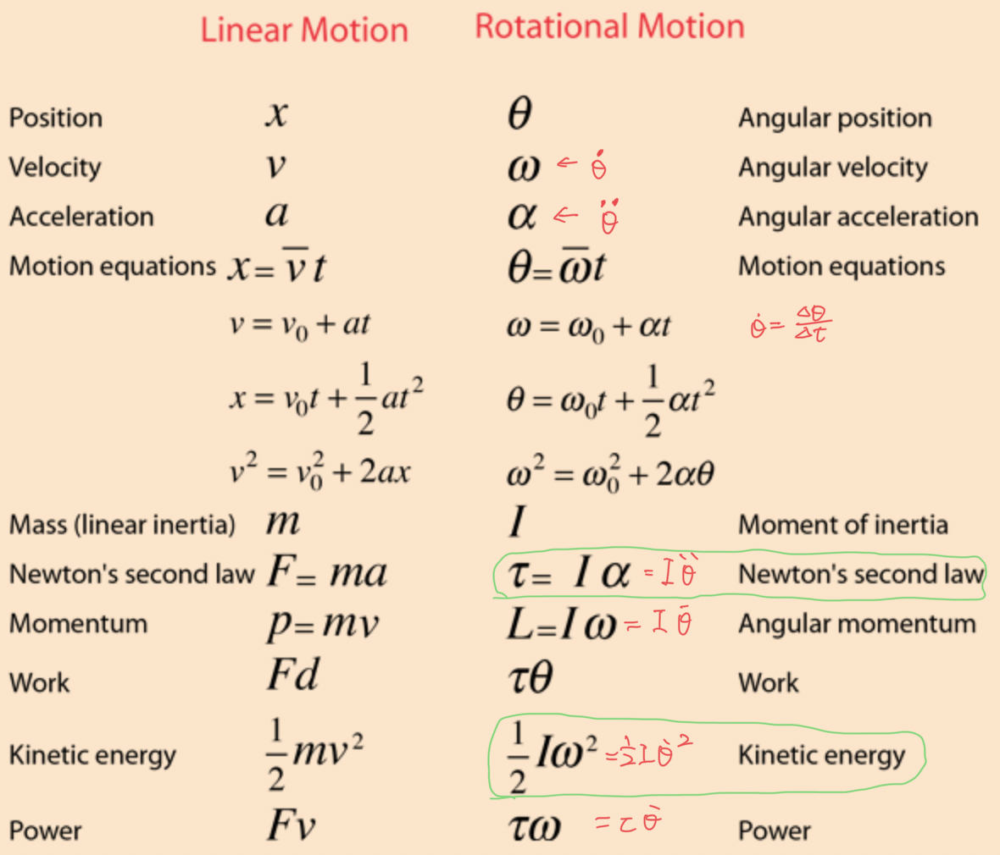
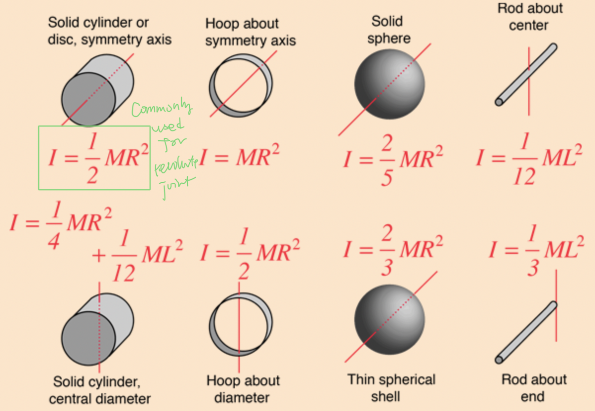

<link type="text/css" rel="stylesheet" href="../md.css">

# Dynamics

### Inertia and moments
In static equilibrium, relationship between end-effector force $F$ and Joint torque $\tau$:
$$
\tau = J^TF
$$

> [Physics prequisite](http://hyperphysics.phy-astr.gsu.edu/hbase/mi.html)

force to torque:
$$
\tau = r \times F = rF\sin\theta
$$

[friction torque(viscous)](https://zh.wikipedia.org/wiki/%E9%98%BB%E5%B0%BC):
$$
\tau = -k\dot{\theta}
$$

>弹性力（k 为弹簧的劲度系数，x 为振子偏离平衡位置的位移）：
>$$
F = -kx
>$$
>阻尼力（c 为阻尼系数，v 为振子速度）：
>$$
F = -cv
$$

Small angle approximations:
$$\sin\theta \approx \theta, \tan\theta \approx \theta, \cos\theta \approx 1-\frac{\theta^2}{2}$$
$$
\sin(u)\sin(v) = \frac{1}{2}[\cos(u-v) - \cos(u+v)]
$$
$$
\cos(u)\cos(v) = \frac{1}{2}[\cos(u-v) + \cos(u+v)]
$$

> **Q**: For arbitrary angular accelaration vector, its linear combination of rotations along axis: 
>
> **A**:
> $$
\tau =
\begin{bmatrix}
\tau_x \\ \tau_y \\ \tau_z \\
\end{bmatrix} =
\underbrace{\begin{bmatrix}
\frac{1}{4}mr^2 +\frac{1}{12}mh^2 & 0 & 0\\ 0 & \frac{1}{4}mr^2 +\frac{1}{12}mh^2 & 0 \\ 0 & 0 & \frac{1}{2}mr^2 \\
\end{bmatrix}}_{\text{Inertia Tensor}}
\begin{bmatrix}
\ddot{\theta_x} \\ \ddot{\theta_y} \\ \ddot{\theta_z} \\
\end{bmatrix} = I\dot{\omega}
> $$
> Diagonal terms called _moments of inertia_. Off diagonals called prodcts of inertia, which are all **ZERO**s when coordinate frame is aligned with principle axes.

### Map from joint space to task space
torque:
$$
\tau = J^TF \rightarrow F^TJJ^TF=1
$$
velocity:
$$
\dot{q} = J^+\dot{x} \rightarrow \dot{x}^T(JJ^T)^{-1}\dot{x}=1
$$
The principle axes of 2 ellipsoids have same directions but _inverse_ magnitude.

### Lagrangian
Define Lagrangian:
$$
L = \underbrace{KE}_{\text{kinematic energy}} - \underbrace{PE}_{\text{potential energy}}
$$
KE should include _both_ linear and angular.

Lagrange equation:
$$
\frac{d}{dt} (\frac{\partial{L}}{\partial{\dot{\theta}}}) -\frac{\partial{L}}{\partial{\theta}} = F_{ext} = \sum\tau
$$

### Forward/Inverse dynamics
(Equations of motion) When forces do not cancel out and the equations of how robot will accelarate at given time.

In general, **Inverse dynamics equation** for rigid body manipulators:
$$
\underbrace{M(q)}_{\text{Inertia Matrix}}\ddot{q}+ \underbrace{B(q)}_{\text{Coriolis M惯性}}[\dot{q}\dot{q}]+\underbrace{C(q)}_{\text{Centrifugal M离心}}[\dot{q}^2]+\underbrace{G}_{\text{Gravity Vector}}(q) = \underbrace{\tau}_\text{external forces}
$$
where
$$
\text{Joint velocities: } [\dot{q}\dot{q}]=[\dot{q_1}\dot{q_2}, \dot{q_1}\dot{q_3}, ..., \dot{q_{n-1}}\dot{q_n} ]^T
$$
$$
[\dot{q}^2] = [\dot{q}_1^2,\dot{q}_2^2,...,\dot{q}_n^2]^T
$$
M,B,C,G all configuration **dependent (on $\theta$** not $\dot{\theta},\ddot{\theta}$)

Inertia Matrix *M* MUST be **symmetric**, positive definite, invertible:
$$
\underbrace{\begin{bmatrix}
\frac{\partial\tau_1}{\partial\ddot{\theta_1}} & \frac{\partial\tau_1}{\partial\ddot{\theta_2}} & ... & \frac{\partial\tau_1}{\partial\ddot{\theta_n}}
\\\\
\frac{\partial\tau_2}{\partial\ddot{\theta_1}} & \frac{\partial\tau_2}{\partial\ddot{\theta_2}} & ... & \frac{\partial\tau_2}{\partial\ddot{\theta_n}}
\\...\\
\frac{\partial\tau_n}{\partial\ddot{\theta_1}} & \frac{\partial\tau_n}{\partial\ddot{\theta_2}} & ... & \frac{\partial\tau_n}{\partial\ddot{\theta_n}}
\end{bmatrix}}_{M}
\underbrace{\begin{bmatrix}
\ddot{\theta_1} \\\\ \ddot{\theta_2} \\...\\ \ddot{\theta_n}
\end{bmatrix}}_{\ddot{q}}
$$

Centrifugal Matrix:
$$
\underbrace{\begin{bmatrix}
\frac{\partial\tau_1}{\partial\dot{\theta_1}^2} & \frac{\partial\tau_1}{\partial\dot{\theta_2}^2} & ... & \frac{\partial\tau_1}{\partial\dot{\theta_n}^2}
\\\\
\frac{\partial\tau_2}{\partial\dot{\theta_1}^2} & \frac{\partial\tau_2}{\partial\dot{\theta_2}^2} & ... & \frac{\partial\tau_2}{\partial\dot{\theta_n}^2}
\\...\\
\frac{\partial\tau_n}{\partial\dot{\theta_1}^2} & \frac{\partial\tau_n}{\partial\dot{\theta_2}^2} & ... & \frac{\partial\tau_n}{\partial\dot{\theta_n}^2}
\end{bmatrix}}_{C}
\underbrace{\begin{bmatrix}
\dot{\theta_1}^2 \\\\ \dot{\theta_2}^2 \\...\\ \dot{\theta_n}^2
\end{bmatrix}}_{[\dot{q}^2]}
$$

Coriolis Matrix:
$$
\underbrace{\begin{bmatrix}
\frac{\partial\tau_1}{\partial\dot{\theta_1}\dot{\theta_2}}
\\...\\
\frac{\partial\tau_n}{\partial\dot{\theta_1}\dot{\theta_2}}
\end{bmatrix}}_{B}
\underbrace{\begin{bmatrix}
\dot{\theta_1}\dot{\theta_2}
\end{bmatrix}}_{[\dot{q}\dot{q}]}
$$

Gravity Vector:
$$
\underbrace{\begin{bmatrix}
\tau_1 - M_1-C_1-B_1
\\...\\
\tau_n - M_n-C_n-B_n
\end{bmatrix}}_{G}
$$

Because M is invertible, **Forward dynamics equation** can be:

$$
\ddot{q} = M(q)^{-1}(-C(q,\dot{q})-G(q)+\tau)
$$

Forward Dynamics useful for simulation & prediction.
Inverse Dynamics useful for control.

