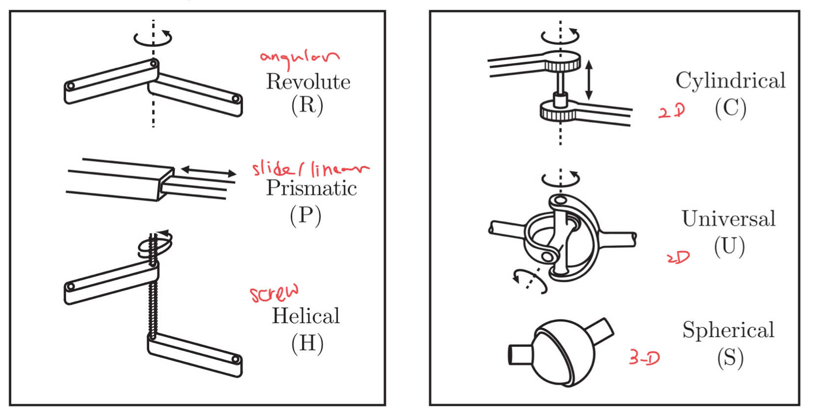
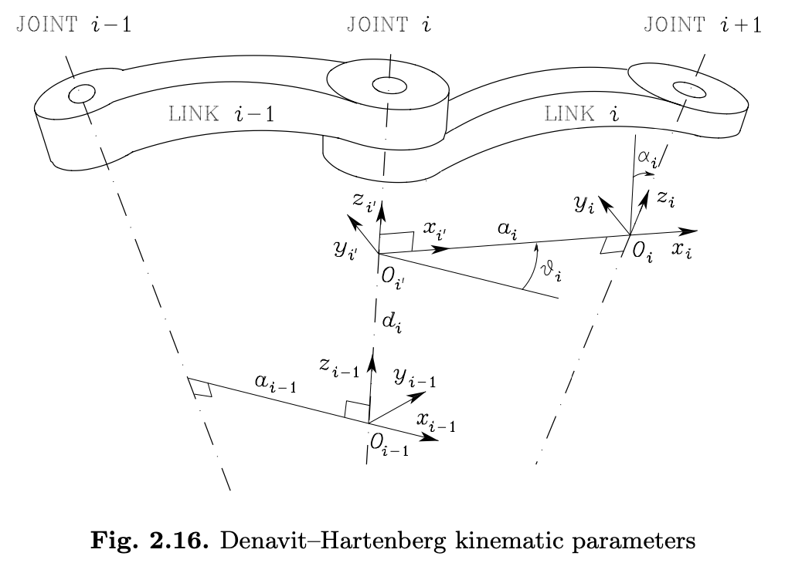

<link type="text/css" rel="stylesheet" href="../md.css">

# [Home](../../index.md) > [Advanced Robotics](README.md) > FK/IK

## Basics
* Degree of Freedom (DoF)
* Under-actuation
* Redundancy
* Workspace

**Typical robot joints**
2 main type: Revolute & Prismatic

**Robot configuration** ( position of all points of the robot)
Only focus on Rigidbody

End-effector configuration parameters:
$X=\begin{bmatrix}
X_P\\ X_R
\end{bmatrix}$

$X_P$: Position representations (3 DOF = 3 parameters)
* _Cartesian_ $<x, y, z>$
* Cylindrical $<\rho, \theta, z>$
* Spherical $<r , \theta, \phi>$

$X_R$: Rotation Reps (3 DOF = 9 params - 6 constraints) $\leftarrow$ redundent expression

$$
R =
\begin{bmatrix}
r_{11} & r_{12} & r_{13} \\
r_{21} & r_{22} & r_{23} \\
r_{31} & r_{32} & r_{33} \\
\end{bmatrix}
=
\begin{bmatrix}
r_{1} & r_{2} & r_{3} \\
\end{bmatrix}
$$
Because the redundency in rotation matrix, so there *MUST* exist *constraints (6)*
$
|r_1|=|r_2|=|r_3|=1
$

$
r_1\cdot r_2 = r_2\cdot r_3 = r_3\cdot r_1 = 0
$

### angular representations:
* Euler Angles (`Z-Y-Z`) - _current_ frame - post multiplication
* Euler ZYX Angles (Roll-Pitch-Yaw`Z-Y-X`) - _Fixed_ frame - left multiplication
* Quaternions ( to avoid singularity )

### From Rotation Matrix to Euler Angles
Use `arc2`

> **Q**:  What's the properties of rotation matrix?
>
> **A**:
> - A rotation matrix will always be a square matrix.
> - As a rotation matrix is always an orthogonal matrix
> - the transpose will be equal to the inverse of the matrix.
> - The determinant of a rotation matrix will always be equal to 1.
> - Multiplication of rotation matrices will result in a rotation matrix.
> - Furthermore, for clockwise rotation, a negative angle is used.

> **Q**: how to determine a matrix is a rotation matrix.
given
$
R^A_B =
\begin{bmatrix}
\cos \theta & 0& \sin \theta \\
\sin \phi \sin\theta & \cos\phi & -\sin\phi\cos\theta\\
-\cos\phi\sin\theta & \sin\phi & \cos\phi\cos\theta \\
\end{bmatrix}
$
>
> **A**: calculate the $det(R^A_B)=1$ and prove $R^{-1} = R^T  \Leftrightarrow RR^T=I$

**Degree of Freedon ( DOF )**

**homogeneous transformation**

$~^A P$ is point `P` represented in coordinates `A`

$~^A_B T$ transform matrix from coordinates `B` to `A`

$
~^A P = ~^A_B T ~^B P = ~^A_B T ~^B_C T ~^C P = ~^A_C T ~^C P
$

$
\Rightarrow \red{~^A_C T = ~^A_B T ~^B_C T} =
\begin{bmatrix}
~^A_B R~^B_C R &  ~^A_B R ~^B P_{origin C} + ~^A P_{origin B} \\
0^T &  1\\
\end{bmatrix}
$

### Elementary Rotations
$$
R_z(\alpha)=
\begin{bmatrix}
\cos \alpha & \red- \sin \alpha & 0\\
\sin \alpha & \cos \alpha & 0\\
0 & 0 & 1\\
\end{bmatrix}
$$

$$
R_y(\beta)=
\begin{bmatrix}
\cos \beta & 0& \sin \beta \\
0  & 1& 0\\
\red- \sin \beta & 0& \cos \beta \\
\end{bmatrix}
$$

$$
R_x(\gamma)=
\begin{bmatrix}
1 & 0& 0\\
0 &\cos \gamma &  \red- \sin \gamma \\
0& \sin \gamma & \cos \gamma \\
\end{bmatrix}
$$

Rotate base on **current frame** => Post multiplication ( Right )

Rotate base on **fixed frame** => Pre multiplication ( Left )

### Inverse
$
p^b=o^b_e+R_e^bp^e
$

### DH parameters (Denavit-Hartenberg)
> P62 [link](https://www.youtube.com/watch?v=rA9tm0gTln8)
* z- prismatic translate along z; revolute rotate along z;
* Locate the origin Oi at the intersection of axis zi with the common normal
to axes zi−1 and zi. Also, locate Oi′ at the intersection of the common
normal with axis zi−1
* x- parallel to common normal of ( $z^{i-1}, z^i$), with direction
from Joint i to Joint i + 1
* y- right hand coordinates
* di: distance between Oi-1 and Oi’ along zi-1 <!-- (For prismatic joints) -->
* θi: angle between xi-1 and xi about **zi-1** (For revolute joints, θi defines the motion)
* **ai**: distance between Oi and Oi’
* $\alpha_i$: angle between zi-1 and zi about **xi**, positive for counter-clockwise.

(to make operation easier, try to define base frame overlap with 1st frame, & overlap intermediate frame)

1. define z-
1. origin ( intersection of common normal of $z^i, z^{i-1}$)
1. $x^i$ is defined alone common normal, with direction of right hand from $z^{i-1}, z^i$
1. y force right hand corrdinates
1. $\alpha^i$ is right hand from $z^{i-1}, z^i$
1. For Frame 0, only the direction of axis z0 is specified; then O0 and x0 can be arbitrarily chosen.
1. For Frame n, since there is no Joint n + 1, zn is not uniquely defined while xn has to be normal to axis zn−1. Typically, Joint n is revolute, and thus zn is to be aligned with the direction of zn−1.

### Homogeneous Transformation Matrix

Given the four D-H parameters for joint i: $a_i, d_i, \theta_i, \alpha_i$, we can
compute the homogeneous transformation matrix from joint i-1 to joint i.

1. choose a frame aligned with Frame i-1.
2. Translate frame along $z_{i-1}$ by ${d_i}$ and rotate by $\theta_i$:
$$
A^{i-1}_{i'} =
\begin{bmatrix}
c\theta_i & -s\theta_i & 0 & 0 \\
s\theta_i & c\theta_i & 0 & 0 \\
0 & 0 & 1 & d_i \\
0 & 0 & 0 & 1\\
\end{bmatrix}
$$
3. Translate frame along $x_{i'}$ by $a_i$ and rotate by $\alpha_i$:
$$
A^{i'}_i =
\begin{bmatrix}
1 & 0 & 0 & a_i \\
0 & c\alpha_i & -s\alpha_i & 0 \\
0 & s\alpha_i & c\alpha_i & 0 \\
0 & 0 & 0 & 1\\
\end{bmatrix}
$$

Resulting (Eq.2.52):

$
A^{i-1}_i(q_i)=A^{i-1}_{i'}A^{i'}_{i}=
\begin{bmatrix}
\pink{\cos\theta_i} & \pink{-\sin\theta_i}\cos\alpha_i & \sin\theta_i\sin\alpha_i & \pink{a_i\cos\theta_i} \\
\pink{\sin\theta_i} & \pink{\cos\theta_i}\cos\alpha_i & -\cos\theta_i\sin\alpha_i & \pink{a_i\sin\theta_i} \\
0 & \sin\alpha_i & \cos\alpha_i & d_i \\
0 & 0 & 0 & 1\\
\end{bmatrix}
$

<!-- For revolute planar arm, reduces to (pink colored), where $a_i$ is constant:
$
A^{i-1}_i(\theta_i)=
\begin{bmatrix}
\cos\theta_i & -\sin\theta_i  & 0 & a_i\cos\theta_i \\
\sin\theta_i & \cos\theta_i  & 0 & a_i\sin\theta_i \\
0 & 0 & 1 & 0 \\
0 & 0 & 0 & 1\\
\end{bmatrix}
$ -->

For prismatic planar,
$
A^{i-1}_i(d_i)=
\begin{bmatrix}
1 & 0  & 0 & a_i \\
0 & \cos\alpha_i  & -\sin\alpha_i & 0 \\
0 & \sin\alpha_i & \cos\alpha_i & d_i \\
0 & 0 & 0 & 1\\
\end{bmatrix}
$

By computing each transformation from joint to joint, and
_post_ multiplying them all together, we have the complete transformation
from the base frame to the end-effector frame

$
T^0_n(q)=A^0_1(q_1)A^1_2(q_2)...A^{n-1}_n(q_n) \\\\
\Leftrightarrow X_e=k(q)=\begin{bmatrix}p_e & \phi_e\end{bmatrix}^T
$
$
q=\begin{bmatrix}q_1 & ... & q_n\end{bmatrix}^T
$

where $q_i=\theta_i$ for revolute joint, $q_i=d_i$ for  prismatic joint

> **Q**: Given an arm,
> **A**:
>1. define frame
>1. define dh parameter
>1. computer post multiplication

###  Direct Kinematic Equation
$$
x_e=k(q)
$$

- k is a vector function that maps _joint space_($q=[q_1,q_2,q_n]^T$) to _operational space_([$P_x,P_y,P_z,R_x,R_y,R_z]^T$)
- k is the direct kinematics function

Note in general:
- k is a non-linear vector function
- k is surjective: every q vector gets mapped to one and only one xe vector.
- But not the other way around: k-1 is ill-posed: the number of solutions for k-1 may be zero, finite, or infinite

### Jaccobian -- w3
$
\frac{dx_e}{dt} =
\begin{bmatrix}
\frac{\partial k_1}{\partial q_1} & \frac{\partial k_1}{\partial q_2} & \frac{\partial k_1}{\partial q_3} \\\\
\frac{\partial k_2}{\partial q_1} & \frac{\partial k_2}{\partial q_2} & \frac{\partial k_3}{\partial q_3} \\
\end{bmatrix}
\begin{bmatrix}
\frac{dq_1}{dt} \\\\
\frac{dq_2}{dt} \\\\
\frac{dq_3}{dt}
\end{bmatrix}
$

$
\Leftrightarrow
\dot{X}_e=\pink{\frac{\partial k(q)}{\partial q}}\dot{q} = J(q)\dot{q}
$

> **Q**: Calculate the J of the arm.
>
> 
>
>**A**:
>$
X_e=\begin{bmatrix}p_x & p_y & \phi\end{bmatrix}^T=k(q)=
\begin{bmatrix}
a_1c_1+a_2c_{12}+a_3c_{123} \\
a_1s_1+a_2s_{12}+a_3s_{123} \\
\theta_1+\theta_2+\theta_3
\end{bmatrix}
$
>$J(q)=\frac{\partial k(q)}{\partial q} =
\begin{bmatrix}
-a_1s_1-a_2s_{12}-a_3s_{123} & -a_2s_{12}-a_3s_{123} & -a_3s_{123} \\
a_1c_1+a_2c_{12}+a_3c_{123} & a_2c_{12}+a_3c_{123} & a_3c_{123} \\
\theta_1 & \theta_2 & \theta_3
\end{bmatrix}
$

**Derive $J$**

$
p^b=o^b_e+R_e^bp^e
$
taking derivative on both side $\frac{d}{dt}p^b\Rightarrow$

$$
\dot{p}^b=\overbrace{\dot{o}^b_e}^{\text{change in displacement between frames}}+\underbrace{\pink{\dot{R}^b_ep^e}}_{\text{velocity of rotation}}+\overbrace{R^b_e\dot{p}^e}^{\text{velocity w.r.t. end-eff frame }} \blue{\leftarrow\text{product rule}}
$$
where  $\dot{R}^b_ep^e = \omega \times p^e_b = \omega \times R^b_ep^e$

$
\omega_i=\omega_{i-1}+\pink{\omega_{i-1,i}} \blue{\leftarrow \text{relative rotation between 2 frames}}
$

### Singularities / Redundancy
When J drops ranks, not inversible.
Calculate $det(J) =0$

Rank: number of linearly independent
columns = number of linearly independent rows = _number of DOFs_ in the Range space

#DOFs in operational space + #DOFs in null space = #DOFs of the robot (n)

Ways to deal with singularities:
1. try to stay away from them
2. change task priorities
3. use damped least squares
4. Jacobian Transpose (numerically very simple! but need to assume: $\dot x_ d = 0$ )

### Inverse Kinematics
$$
\dot q = J^+ \dot x + \underbrace{( I  - J ^+ J ) }_{\text{null space projection matrix}}\dot q_0
$$
where  $J^+ = J^T (JJ^T )^{-1}$ is Moore-Penrose pseudoinverse.

$\dot q_0$ can be used to achieve secondary objectives.

