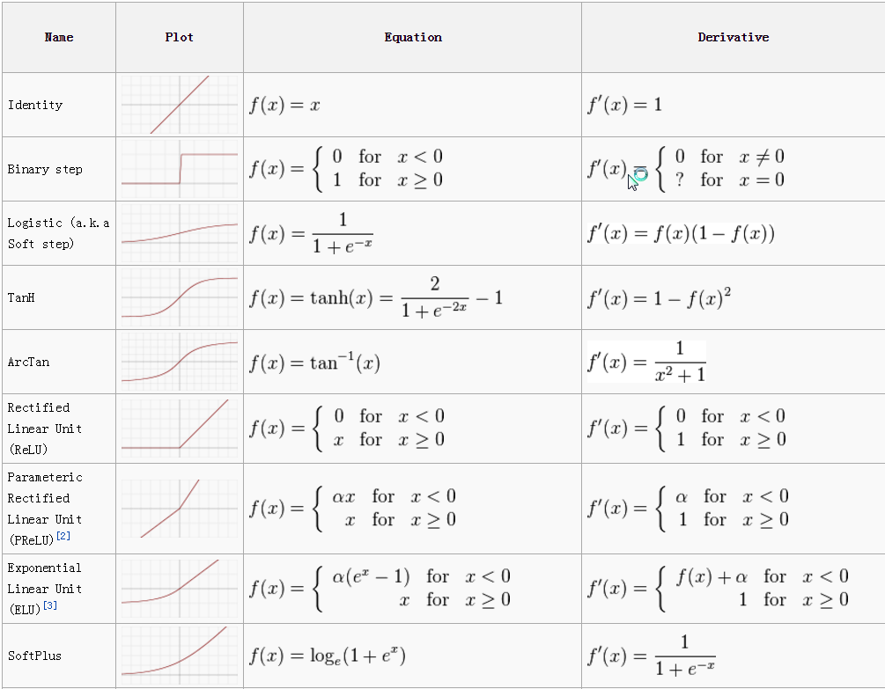

## [Activation functions](https://towardsdatascience.com/activation-functions-neural-networks-1cbd9f8d91d6)

|                            | output           |                |                                                                     |                                                                                          |
|----------------------------|------------------|----------------|---------------------------------------------------------------------|------------------------------------------------------------------------------------------|
| linear/I                   | +-infinity       | differentiable |    | cause a neural network to get stuck at the training time.                                |
| Sigmoid/Logistic           | (0 to 1)         | differentiable |  |                                                                                          |
| Tanh/hyperbolic tangent    | (-1 to 1)        | differentiable |  | mapped strongly negative and the zero inputs will be mapped near zero in the tanh graph. |
| ReLU/Rectified Linear Unit | [ 0 to infinity) |                |  | not mapping the negative values appropriately.                                           |
| Leaky ReLU                 | +-infinity       |                |                                                                     | attempt to solve the dying ReLU problem                                                  |
# Linear Regression and Gradient Descent

# MLP
# BP
# OPT

# CNN
# RNN
