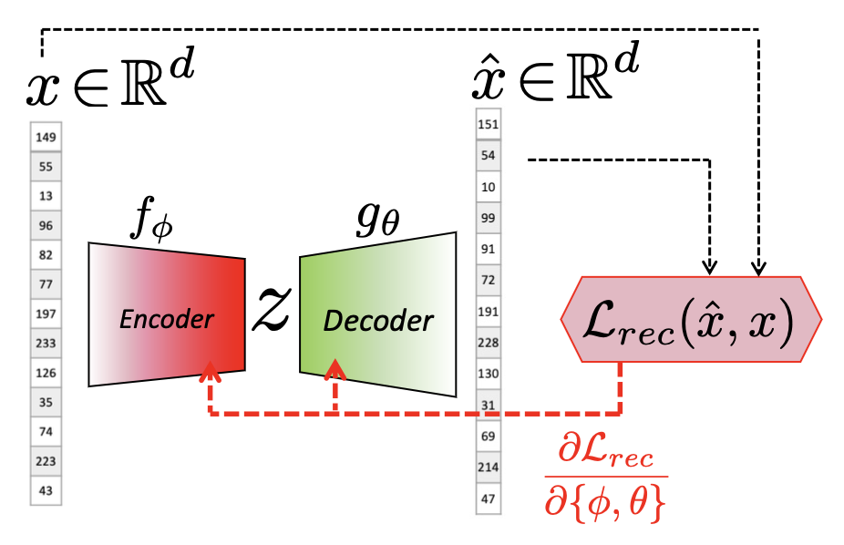
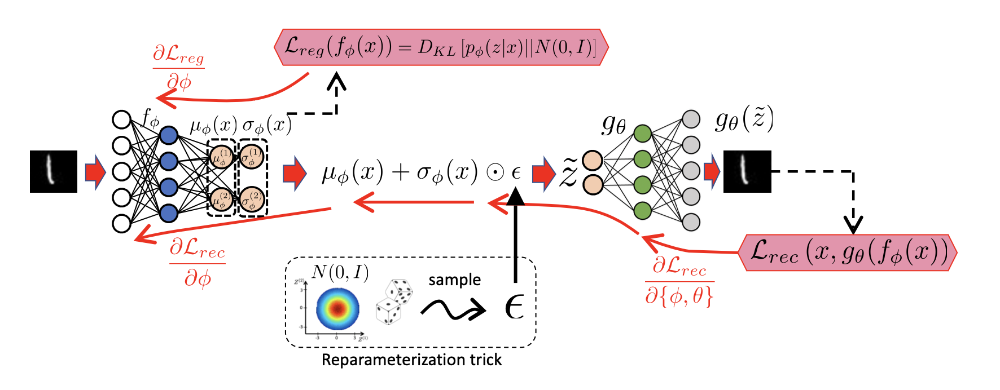
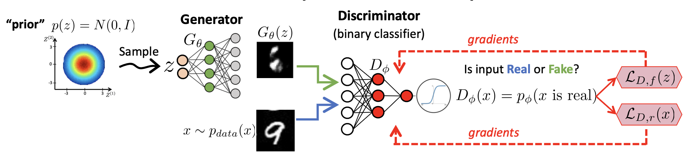
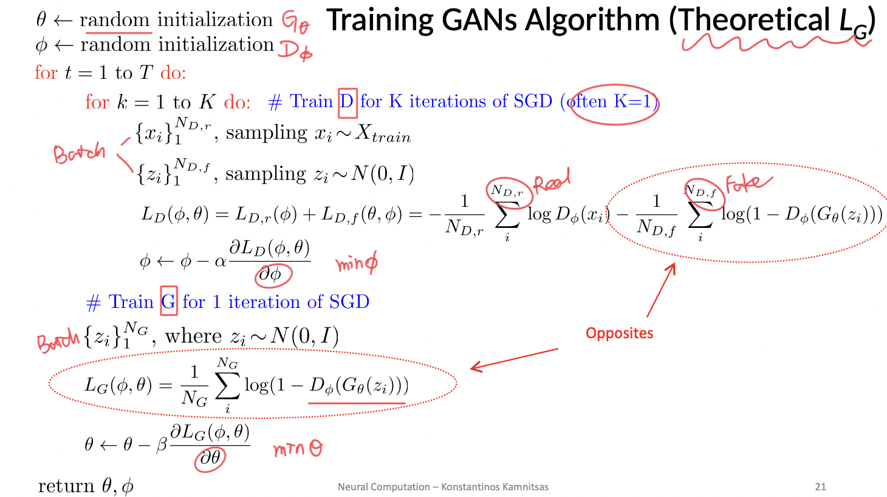
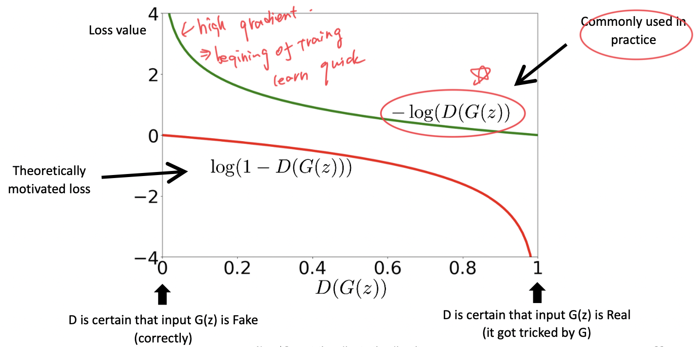

<!-- # Unsupervised Learning -->

- [Basics](nc_basics.md)
- [Unsupervised Learning](nc_unsupervised.md)

Labelled data is limited (time consuming, requires expertise, label in every possible situation).

**Unsupervised learning**: From observations ($X$) to _latent variables_ ($Z$, infer), without labeled data.

Available data: $x_1, ..., x_N \sim \mathcal{p}_{data}(x)$

Goal: Learn _useful features_ of the data / Learn _the structure_ of the data.

Used for:
  * Represent data to a lower dimension through _PCA_ (compress image or audio)
  * Group data by similarity through _clustering_ (text analysis, social media users, produce labelled data)
  * Estimate PDF through _Probability Density Estimation_ (generate fake data)
  * Create style or fake images through _generation_ / _synthesise_ (synthesize shoe styles from contours just by giving a few examples, image enhancement)

## Auto-Encoders

Given data we want the model to infer something about the content/characteristics, i.e., the _latent variable_. We _encode_ the data first, then _decode_ it.
We use _bottleneck_ layer in the middle to compress the data we're learning (otherwise, if it's of the same dimension, the parameters would only be the identity matrices)

**Standard / Basic AE** refers to AE with bottleneck

**Reconstruction error** - in most cases just _MSE_(Mean-Squared Error) which includes the parameters of the _encoder_ $f_{\phi}$ and the _decoder_ $g_{\theta}$. We minimize it to `0` when finding optimal parameters.

$$\mathcal{L}_{rec}=\frac{1}{N}\sum_{d=1}^D(x^{(d)}-g_{\theta}^{(d)}(f_{\phi}(x)))^2$$

$$\phi^*,\theta^*=\operatorname*{argmin}_{\phi, \theta}\mathcal{L}_{rec}$$

> Compression forces the _encoder_ to learn the most prominent features

**Trade-off**: Wider-bottleneck structure gives better construction & less compression.

Applications:
* **Compress data** - and encoded movie could be stored on a server, a decoder could be stored on a cloud or user's computer which would allow fast streaming with reduced resources
* **Cluster data** - encoders in a way cluster data due to the same decoder - it has to cluster _latent variables_ if it wants to recreate similar representations for similar input data
* **Learn a classifier** - we keep the encoder that produces cluster representation (tho not necessarily useful for classifier) and attach a classifier that learns the decision boundaries
* **Data synthesis** - we keep the decoder and sampling a random _latent variable_ (if it is within realistic space). Due to curse of dimensionality, vanilla AEs are _NOT_ appropriate for this because a randomly sampled _latent variable_ in high dimension can be sampled from an unrepresentative space (i.e., where no real data would be encoded to)

> **NOT** trained for generate new fake data. -> sampling problems, gaps in input space.

## Generative Model

> "A generative model describes how a dataset is generated, in terms of a **probabilistic model**. By **sampling** from this model, we are able to generate new data.”
--Generative Deep Learning, David Foster

We train them to perform _probability density estimation_

For frequency-based approximation techniques the number of samples needed to fill the space grows exponentially with the number of dimensions.

In _high dimensions_, the input space would basically be empty.
=>
So difficult to do PDE directly.
=>
Indirectly by _enforcing_ samples from model to be similar to real data.
(VAEs / GANs)

## Variational Auto-Encoders

**VAE** - uses an _encoder_ that maps each input to a small multivariate Gaussian (with uncorrelated dimensions) which is part of a larger prior distribution and a _decoder_ which is forced to decode from that prior

$$p_{\phi}(\mathbf{z}|\mathbf{x})=\mathcal{N}(\bm \mu_{\phi}(\mathbf{x}), \bm \sigma_{\phi}(\mathbf{x})^2)$$

> Note: because standard deviation must be positive, we assume the raw output of an _encoder_ is log of standard deviation $\log (\bm \sigma_{\phi}(\mathbf{x}))$. To get actually get it, we apply the exponent. Not using _ReLU_ due to bad gradient around `0` thus neurons die quickly.

**Stochastic Decoder** - _decoder_ which at each SGD iteration for each input draws a different encoded sample that is determined by the probability clusters and tries to reconstruct any sample, even the unlikely ones.

Overall loss function for **VAE** consists of `2` parts. _Reconstruction loss_ helps to learn to create new realistic data and the **regularizer** takes care of the prior. We want to minimize the loss on average over all training data.

$$\mathcal{L}_{\text{VAE}}=\mathcal{L}_{rec}+\lambda\mathcal{L}_{reg}$$

$$\phi^*,\theta^*=\operatorname*{argmin}_{\phi, \theta}(E_{x\sim p_{data}}[\mathcal{L}_{rec}] + \lambda E_{x\sim p_{data}}[\mathcal{L}_{reg}])$$

With reconstruction loss, we try to reproduce $x$ for any $\tilde z \sim p_{\phi}(z|x)$ as opposed to directly encoded point $f_{\phi}(x)$. If Gaussians overlap, the loss is high. It learns _means_ that cluster samples and small _STDs_ that reduce overlap.

$$E_{x\sim p_{data}}[\mathcal{L}_{rec}]=\frac{1}{D}\sum_{d=1}^D(x^{(d)}-g_{\theta}^{(d)}(\tilde z))^2$$

With regularization we prevent distributions to turn to points (with `0` std) - we minimize **KL Divergence** between predicted posterior $\tilde z$ and Gaussian $\mathcal{N}(0, I)$. $D_{KL}$ between `2` Gaussians. Causes _means_ to be around `0` and _STDs_ to cover prior.

$$E_{x\sim p_{data}}[\mathcal{L}_{reg}]= D_{KL}[p_{\phi}(z|x) || \mathcal{N}(0, I)]=\frac{1}{2}\left(\sum_{d=1}^D\underbrace{(\mu_{\phi}^{(d)}(x))^2}_{\text{minimized at 0}}+\underbrace{(\sigma_{\phi}^{(d)}(x))^2-2\log \sigma_{\phi}^{(d)}(x)-1}_{\text{minimized at 1}}\right)$$

**Re-parameterization** - since sampling is not differentiable, we give a constant to the network $\epsilon \sim \mathcal{N}(0, I)$ with which it simulates sampling $\tilde z=\mu_{\phi}(x)+\sigma_{\phi}\odot \epsilon$.

Applications:
* **Generation** - synthesizing new data. Note that in space of $\tilde Z$ there may still be gaps due to small $\lambda$ encouraging separation of dissimilar data and because SGD may end up in local optimum.
* **Interpolation** - given some $\tilde z$, move from obe to another and see what values get produced. They're a lot smoother with _VAEs_ thant with vanilla _AEs_. Transitions are smooth due to overlapping Gaussians.
* **Alering** - altering specific data features. A new $z=z_1+\alpha(z_{t,avg}-z_1)$ is produced by interpolating the main feature by an average of features with target characteristic (requires knowing which data has target characteristic). E.g., "fake hair".
* **Compression and Reconstruction** - given $x$, we prezict $\tilde z$ and give the mean $\mu_{\phi}(x)$ to the decoder for high quality reconsruction. It's **worse** than _AE_ because it uses _regularization_.

## Generative Adversarial Network

**GAN** - a network which consistes of a _generator_ $G_{\theta}$ which produces data in the same fashion as _VAEs_ and a _discriminator_ which tries to match the model's density function $p_{\theta}(x)$ with the real data density function $p_{data}(x)$ by learning a binary classifier.

When finding the optimal parameters, we take the expected value of the `log` of `sigmoid` as our loss. Because the `log` is monotonically increasing, for $\phi^*$ we just maximize the probability to `1` when the data is real and minimize it to `0` when the data is fake and for $\theta^*$ we maximize the probability when the data is fake:

$$\phi^*=\operatorname*{argmax}_{\phi}\overbrace{E_{x\sim p_{data}(x)}[\log D_{\phi}(x)]+E_{x\sim p_{\theta}(x)}[\log(1-D_{\phi}(\underbrace{x}_{G_{\theta}(z)}))]}^{J_{GAN}(\theta,\phi)}$$

$$\theta^*=\operatorname*{argmin}_{\theta}E_{z\sim p(z)}[\log(1-D_{\phi}(G_{\theta}(z)))]$$

where $x\sim p_{\theta}(x)$ <=> "prior" $z\sim p_(z) = \mathcal{N}(0,I)$

> In practice
  * the expectation is calculated for either a _batch_ of real or fake data.
  * we can convert maximization to minimization by putting `-` in front of `log`s.
  * Use $-log(D(G(z)))$ for $\theta^*$ due to gradients issues.

> Results in:

$$\phi^*=\operatorname*{argmin}_{\phi}E_{x\sim p_{data}(x)}\underbrace{[-\log D_{\phi}(x)]}_{\mathcal{L}_{D,r}(x)}+E_{z\sim p(z)}\underbrace{[-\log(1-D_{\phi}(G_{\theta}(z)))]}_{\mathcal{L}_{D,f}(z)}$$

$$\theta^*=\operatorname*{argmin}_{\theta}E_{z\sim p(z)}\underbrace{[-\log(D_{\phi}(G_{\theta}(z)))]}_{\mathcal{L}_{G}(z)}$$

**Two-player Min-Max game** (from Game Theory) - parameter optimization method where _discriminator_ tries to maximize the accuracy of the classifier and the _generator_ tries to minimize it.

---
Algorithm:

$\theta, \phi \leftarrow$ random initialisation

for $E$ epochs, repeat the below steps:

1. Train _discriminator_ for $K$ (usually `1`) iteration of SGD
  * Sample real $x_i\sim X_{train}$ and fake(prior of z) $z_i\sim \mathcal{N}(0, I)$ data
  * calculate expected(average of batch) loss $\mathcal{L}_D(\phi,\theta)$
  * $\phi\leftarrow \phi-\alpha \frac{\partial \mathcal{L}_D(\phi, \theta)}{\partial \phi}$

2. Train _generator_ for 1 iteration of SGD
  * Sample prior distribution of z, $z_i\sim \mathcal{N}(0, I)$
  * calculate expected(averaged) loss $\mathcal{L}_G(\phi,\theta)$
  * $\theta \leftarrow \theta - \beta \frac{\partial \mathcal{L}_G(\phi, \theta)}{\partial \theta}$

---

If we assume that we can train a **perfect** _discriminator_, optimal $D$ is:

$$ D_{\phi^*}(x) = \frac{p_{data}(x)}{p_{data}(x)+p_{\theta}(x)} $$

the optimization can be proved to be equivalent to minimizing the distance between the real data and fake data distributions, i.e., **Jensen-Shannon divergence**:

$$J_{GAN}(\theta, \phi^*)=2 D_{JS}[p_{data}(x)||p_{\theta}(x)]-2\log 2$$

$$D_{JS}[p_{data}(x)||p_{\theta}(x)]=0 \Leftrightarrow p_{data}(x) = p_{\theta}(x)$$

> Thus perfect $D^*=0.5$

>In practice

* We can't train a perfect _discriminator_ (only $K$ (not infinite) updates and SGD  can result in local minima).
* We use different loss functions for the _generator_. Because with the original `log` loss the network may stop learning from bad fake samples because it is sure they are bad (`log` loss is `0` which means no gradient). For good real samples we would get big gradients and we would try to improve network even more. But what we want is to learn from bad rather than good samples. We substitute:

$$\log(1-D_{\phi}(G_{\theta}(z)))\to -\log D_{\phi}(G_{\theta}(z))$$

> GANs are really powerful for generating fake images and interpalation
