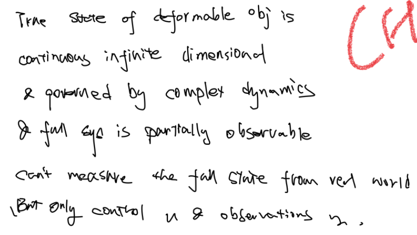
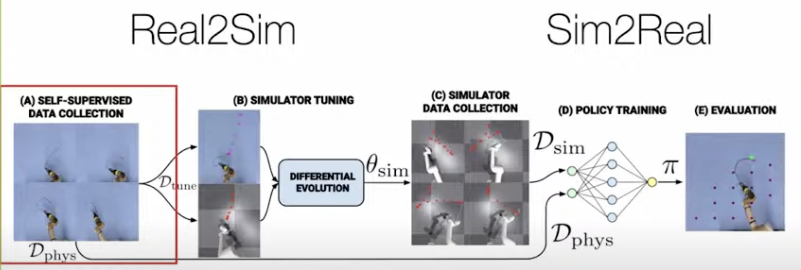

# Representing and Manipulating Deformable Objects @ ICRA2022
> [Youtube](https://www.youtube.com/watch?v=Ir0hUawBWrQ)

## Introductions
Like breaking & making contacts problem, Deformable obj are very common in everyday life and in industry. we as human don't think much when dealing with them but they are quite difficult problems for robots.
we say  Deformable Objects Representing and Manipulating, but it is actually a large area of problems and often task specific.
Have to deal with complex geometry, $\infin$ states, complex contacts/ frictions/ forces.

## CHALLENGES
* Representation and state estimation
  * high/$\infin$ dimension for dynamics and control
  * Goal independent rep for all?
  * no standard/benchmarks to evaluate, what is good
  * environment feedback
* Simulations & Sim2Real Gap:
  * Exist Different sim. "Looks real" from vision people, e.g. toufu breaking
  * No unified parameters/limitation desc, difficult to adjust to task,
  * tradeoff for time/efficiency & precision
  * Differentiable
  <!-- * doufu -->
  <!-- * Simulation and modeling
  * Transfer from simulation to reality -->
* Learning from data-driven methods (RL) VS (expert) demonstrations
  * sim / real
  * Reset ( evaluate )
* Perception
  <!-- *  : state tracking, parameter identification, property detection (e.g. landmarks for garments) and classification, etc. -->
* Control, visual servoing and planning
  * underactuated system, use air/gravity
* Task specific
  * DLO : Deformable linear objects
  * Elasto-Plastic / visco-elastic <!--( deformation & applied force rate (in/)dependent) -->
  * robot surgery, garment folding, agricultural
  * Multi-arm manipulation
  * Specialised tools, e.g. grippers, and sensors
* Make use of modern gpu resources

## Interesting Approaches
### _Kimitoshi Yamazaki_: Cloth manipulation based on hierarchical shape prediction
  * use midstates to track and correct states
  * mesh rep ( determined )
  * use gaussian estimation for occlusion
  * point cloud -> voxel -> (VtM NET) probabilistic mesh -> topology to refine
### _Youcef Mezouar_: The european project Softmanbot : handling deformable and flexible materials for the industry
### _Ken Goldberg_: <u>Real2Sim2Real</u>: A Model for Deep Learning to Manipulate Deformable Objects
  * collect in real rollouts -> train in sim -> deploy in real
  * train on less data to achieve better result
  * 
### _Andrea Cherubini_: See and shape: vision-based robot manipulation of non-rigid objects
  * define error function
  * controller based on feature (state) it affacts $x_{k+1} -x_k=L_k u_k$
  * learnnig mapping L by relating contours and actions (NN)
### _Shuran Song_: The Reasonable Effectiveness of Dynamic Manipulation for Deformable Objects
  * iterative residual policy ( converge within 3 steps)
  * learn in delta dynamics instead of full
### _Rika Antonova_: Distributional Representations and Scalable Simulations for Real-to-Sim with Deformables
### _Alan Kuntz & Isabella Huang_: Large-Scale Simulation for Calibration-Free Sim to Real Transfer of Deformable Object Manipulation
  <!-- tofu example -->
  * full state tensor ( pos & vel, element stress tensor, contact point& force)
  * use force detect instead of $\Delta$ distance to determine safe to pick/reached desired pos
  * IsaacGym - sim - (quite difficult to model, definitions for vertex)
  * DeformerNet - surgery
### _Carolyn Matl_: Deformable Elasto-Plastic Object Shaping using an Elastic Hand
  * Elasto-Plastic / visco-elastic <!--( deformation & applied force rate (in/)dependent) -->
  * specialised ee, membraine, estimate 1d stiffness (force/movement)

## Discussion

in fact, people from engineering department have spent decades to study them and have books about continous mechanics. DO we need to learn all that and then think about how to solve problems? should we conduct more multisubject research and break the walls in different departments?

human don't explicitly model precisely about the obj & env, we operate on constraints and adjust online while carrying out tasks. should we try same approach with robot arms?

there are some benefits. e.g. pick up teddy bear, because of the natural compliance of soft obj.

<!-- ## @ ICRA2023

**i)** How to tractably represent the state of a deformable object?

**ii)** How to model and simulate its highly complex and non-linear dynamics?

**iii)** What hardware tools and platforms are best suited for grasping and manipulating? -->